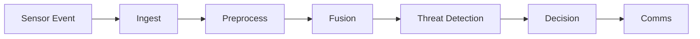
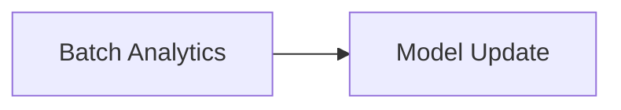
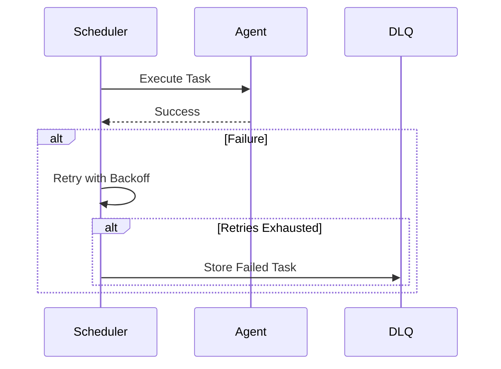
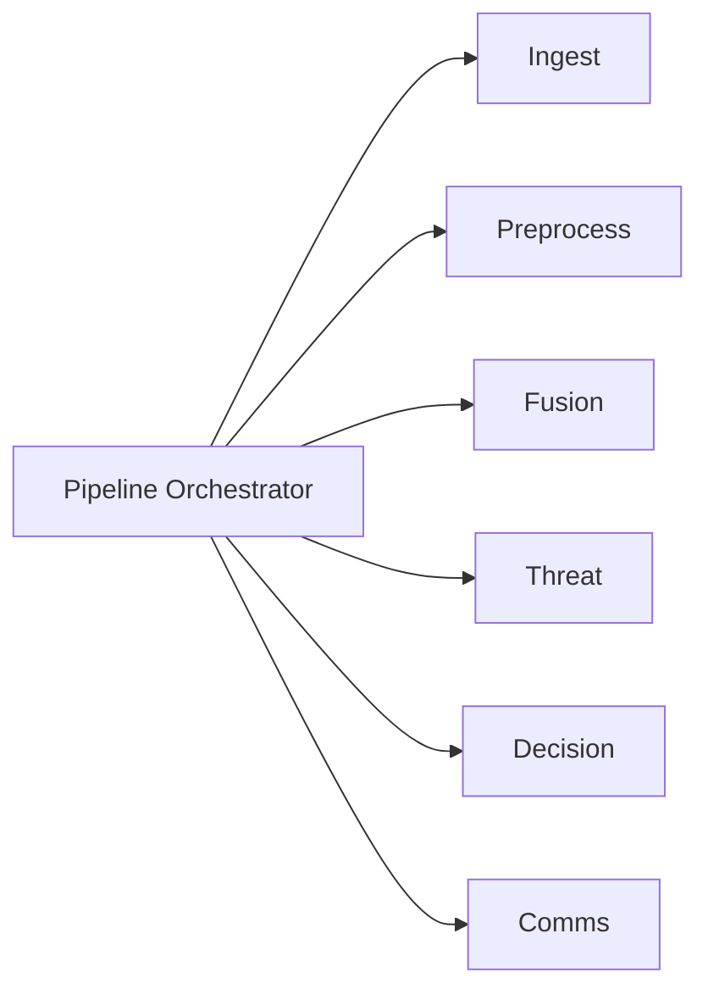

# Defense AI System Architecture (CPU-Only Simulation)

This document describes a simulated on-prem Defense AI system built with:

- Multi-agent components  
- Orchestrated real-time and batch pipelines  
- Logical resource modeling (CPU cores, optional logical GPUs)  
- Priority-based scheduling  
- Fault-tolerant execution  

The system is designed to run entirely on CPU while logically modeling GPU scheduling.

---

## 1. High-Level System Architecture

```mermaid
flowchart LR

  %% ============================
  %% Edge / Sensor Layer
  %% ============================
  subgraph EdgeSensors["Edge Sensors"]
    RADAR[Radar]
    EOIR[EO/IR Camera]
    TEL[Telemetry]
  end

  %% ============================
  %% Event Bus
  %% ============================
  BUS[(On-Prem Event Bus)]

  %% ============================
  %% Orchestration Layer
  %% ============================
  subgraph Orchestration["Pipeline Orchestrator"]
    ORCH[Pipeline Orchestrator]
    SCH[Priority Scheduler]
    RES[Logical Resource Model\n(CPU Cores, GPU Tokens)]
    DLQ[Dead Letter Queue]
  end

  %% ============================
  %% Multi-Agent AI Services
  %% ============================
  subgraph Agents["Multi-Agent AI Components"]
    ING[Ingest Agent]
    PRE[Preprocess Agent]
    FUS[Sensor Fusion Agent]
    THR[Threat Detection Agent]
    DEC[Decision / Policy Agent]
    COM[Comms / Reporting Agent]
    BAT[Batch Analytics Agent]
    MUP[Model Update Agent]
    HM[Health Monitor]
  end

  %% ============================
  %% Connections
  %% ============================
  RADAR --> BUS
  EOIR --> BUS
  TEL --> BUS

  BUS --> ORCH

  ORCH --> SCH
  SCH --> RES

  SCH --> ING
  ING --> PRE
  PRE --> FUS
  FUS --> THR
  THR --> DEC
  DEC --> COM

  SCH --> BAT
  BAT --> MUP

  HM --> SCH
  SCH --> DLQ
```

## 2. Real-Time Mission Pipeline


## 3. Batch Analytics Pipeline


## 4. Scheduler & Resource Model
```mermaid
flowchart TB

  subgraph Scheduler
    RTQ[Real-Time Queue\nPriority 0-4]
    BQ[Batch Queue\nPriority 5+]
  end

  subgraph Resources
    CPU[CPU Core Tokens]
    GPU[GPU Tokens (Logical)]
  end

  RTQ --> DISPATCH[Dispatcher]
  BQ --> DISPATCH
  DISPATCH --> CPU
  DISPATCH --> GPU
```

## 5. Fault Tolerance


## 6. Multi-Agent Syncronization

